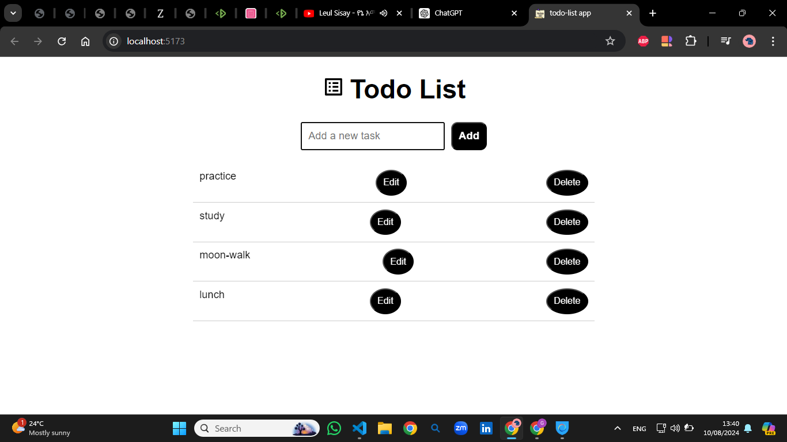

# Todo List App

This is a simple Todo List application built with React, TypeScript, and Vite. The application allows users to add, edit, and delete tasks. It is designed to demonstrate the basics of React components, state management with hooks, TypeScript integration, and the fast development experience provided by Vite.

## Features

- **Add Tasks**: Easily add new tasks to your todo list.
- **Edit Tasks**: Modify existing tasks directly within the list.
- **Delete Tasks**: Remove tasks that are no longer needed.

## Technologies Used

- **React**: A JavaScript library for building user interfaces.
- **TypeScript**: A strongly typed programming language that builds on JavaScript.
- **Vite**: A fast build tool and development server for modern web projects.
- **CSS**: Basic styling for the application.

## Getting Started

### Prerequisites

Make sure you have the following installed on your local machine:

- [Node.js](https://nodejs.org/): JavaScript runtime environment.
- [npm](https://www.npmjs.com/): Node Package Manager, which comes with Node.js.

### Installation

1. **Clone the repository**:

    ```bash
    git clone https://github.com/yourusername/todo-list.git
    cd todo-list
    ```

2. **Install dependencies**:

    Run the following command to install the required packages:

    ```bash
    npm install
    ```

3. **Start the development server**:

    Start the Vite development server using the following command:

    ```bash
    npm run dev
    ```

    The application will run at `http://localhost:5173` by default. Open this URL in your browser to view the app.

### Usage

- **Add a Task**: Type a task description in the input field and click the "Add Todo" button.
- **Edit a Task**: Click on a task to mo


## This is what you will get if you open this app on browser:
  .png)

## This is how it looks after you add some tasks:
  